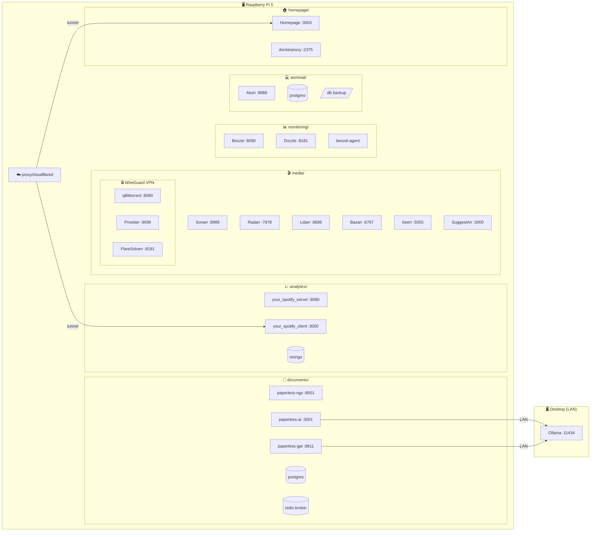

# Homelab

Personal infrastructure-as-code for Docker Compose stacks: media automation, document management, shell history sync, lightweight host monitoring, analytics, and a self-hosted dashboard.



## Layout

| Directory                    | Purpose                                                                                                                                                                             |
| ---------------------------- | ----------------------------------------------------------------------------------------------------------------------------------------------------------------------------------- |
| [`media/`](media/)           | Servarr stack (qBittorrent over WireGuard PIA, Sonarr, Radarr, Lidarr, Bazarr, Seerr, Prowlarr, FlareSolverr, SuggestArr, deunhealth) — see **[media/README.md](media/README.md)**. |
| [`documents/`](documents/)   | AI-powered document management (paperless-ngx + paperless-gpt with Ollama OCR and tagging) — see **[documents/README.md](documents/README.md)**.                                    |
| [`monitoring/`](monitoring/) | [Beszel](https://github.com/henrygd/beszel) hub plus co-located agent — see **[monitoring/README.md](monitoring/README.md)**.                                                       |
| [`terminal/`](terminal/)     | [Atuin](https://atuin.sh/) self-hosted shell history sync server — see **[terminal/README.md](terminal/README.md)**.                                                                |
| [`analytics/`](analytics/)   | [Your Spotify](https://github.com/Yooooomi/your_spotify) self-hosted Spotify listening statistics — see **[analytics/README.md](analytics/README.md)**.                             |
| [`homepage/`](homepage/)     | [Homepage](https://gethomepage.dev) self-hosted dashboard with service widgets and Docker integration — see **[homepage/README.md](homepage/README.md)**.                           |
| [`proxy/`](proxy/)           | [Cloudflare Tunnel](https://github.com/cloudflare/cloudflared) + Nginx Proxy Manager — see **[proxy/README.md](proxy/README.md)**.                                                  |
| [`systemd/`](systemd/)       | Optional systemd units to start each stack at boot — see **Boot with systemd** below.                                                                                               |

Each stack owns its `compose.yml`, `.env.example`, and runtime data under `./data/` (not committed).

## Requirements

- Docker and Docker Compose v2
- Separate `.env` files per stack (copy from each `.env.example`)

Networks are isolated by design (for example media on `172.39.0.0/24`, monitoring on `172.39.1.0/24`, analytics on `172.39.2.0/24`). Adjust subnets in `.env` if they clash with your LAN or other projects.

## Media

See **[media/README.md](media/README.md)** for environment variables, ports, qBittorrent/VPN notes, an **example `/data` directory tree** (libraries and download folders), and **optional persistent CIFS mounts** when movies and TV live on a remote NAS under `/data`.

Quick start:

```bash
cd media
cp .env.example .env   # edit with your secrets and LAN/VPN settings
docker compose up -d
```

## Documents

See **[documents/README.md](documents/README.md)** for the full setup including Ollama LAN configuration, how to generate the paperless-ngx API token, model roles, and the tag-based processing workflow.

> Ollama runs on a separate, more powerful machine on the LAN. paperless-ngx and paperless-gpt run on the server (e.g. Raspberry Pi).

Quick start:

```bash
cd documents
cp .env.example .env   # set PAPERLESS_SECRET_KEY, PAPERLESS_API_TOKEN, OLLAMA_HOST
docker compose up -d broker paperless-ngx
docker compose exec paperless-ngx python3 manage.py createsuperuser
docker compose exec paperless-ngx python3 manage.py drf_create_token <username>
# paste token into .env, then:
docker compose up -d
```

## Monitoring

See **[monitoring/README.md](monitoring/README.md)** for Beszel hub and agent setup, environment variables, extra filesystem mounts, and remote agents.

Quick start:

```bash
cd monitoring
cp .env.example .env   # set BESZEL_URL; add BESZEL_AGENT_KEY / TOKEN from the UI after first visit
docker compose up -d
```

## Terminal

See **[terminal/README.md](terminal/README.md)** for Atuin sync server setup, Postgres notes, and how to point shell clients at this server.

Quick start:

```bash
cd terminal
cp .env.example .env   # set ATUIN_DB_NAME, ATUIN_DB_USERNAME, ATUIN_DB_PASSWORD
docker compose up -d
```

## Analytics

See **[analytics/README.md](analytics/README.md)** for Spotify developer app setup, Cloudflare Tunnel configuration, DNS notes, and ARM/Raspberry Pi specifics.

Quick start:

```bash
cd analytics
cp .env.example .env   # set YOUR_SPOTIFY_API_ENDPOINT, YOUR_SPOTIFY_CLIENT_ENDPOINT, SPOTIFY_PUBLIC, SPOTIFY_SECRET
docker compose up -d
```

## Homepage

See **[homepage/README.md](homepage/README.md)** for config file layout, Docker integration via dockerproxy, background image setup, and service widget variables.

Quick start:

```bash
cd homepage
cp .env.example .env   # set HOMEPAGE_ALLOWED_HOSTS and service URLs/keys
docker compose up -d
```

## Proxy

See **[proxy/README.md](proxy/README.md)** for Cloudflare Tunnel setup and adding public hostnames.

Quick start:

```bash
cd proxy
cp .env.example .env   # set CLOUDFLARED_TOKEN from the Zero Trust dashboard
docker compose up -d
```

## Boot with systemd (optional)

Unit files live in [`systemd/`](systemd/). They run each stack with `docker compose up` from the matching directory and are suitable for enabling stacks at boot on a single host.

**Install (paths assume this repo at `/home/lexcode/code/homelab`; edit the unit files if your clone lives elsewhere):**

```bash
sudo cp systemd/*.service /etc/systemd/system/
sudo systemctl daemon-reload
sudo systemctl enable --now media.service documents.service monitoring.service analytics.service terminal.service homepage.service proxy.service
```

**Why `proxy.service` lists other stacks in `After=`:** The proxy stack includes [Nginx Proxy Manager](https://nginxproxymanager.com/) joined to **external** Docker networks (`servarrnetwork`, `documentsnetwork`, etc.). Those networks are created when each respective `docker compose` stack starts. If `proxy.service` runs first, Compose fails with “network … not found.” So the proxy unit must start **after** every stack that defines those named networks.

Order is encoded only in `proxy.service`; other units only need `After=docker.service` and `Requires=docker.service`.

**`Requires=` vs `After=`:** Other stacks do not use `Requires=` on each other so one failing service does not block Docker or unrelated stacks. Only `proxy` needs strict ordering relative to the stacks whose networks it imports.

## Secrets and git

Do not commit real `.env` files or credentials. Never put tunnel tokens, API keys, or passwords in `compose.yml` comments. Runtime database and agent state under `media/data`, `documents/data`, `monitoring/data`, `terminal/database`, `analytics/data`, and similar paths are intended to stay local.

`.cursor/` is listed in `.gitignore` so editor-specific rules stay on your machine and are not shared via the repo; remove that line if you intentionally want to version Cursor project config.
